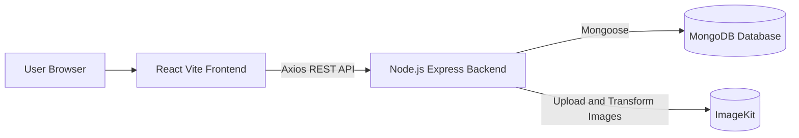

# Car Rental Booking System

## Cover Page

**College Name:** [Enter College Name]  
**Department:** [Enter Department Name]  
**Subject:** Software Engineering and Project Management  
**Project Title:** Car Rental Booking System  
**Technology:** MERN Stack  
**Team Members:**  
- [Name 1] - [Roll No.]
- [Name 2] - [Roll No.]
- [Name 3] - [Roll No.]

**Submitted To:** [Faculty Name]  
**Academic Year:** [Enter Academic Year]

## Abstract

The Car Rental Booking System is a full-stack web application developed using the MERN stack: MongoDB, Express.js, React.js, and Node.js. The application provides an online platform where users can browse available cars, view detailed car information, check availability based on location and rental dates, and create bookings. It also includes an owner module where car owners can list cars, upload car images, manage inventory, track bookings, confirm or cancel requests, and communicate with customers through booking messages.

The system uses JWT-based authentication for secure access, MongoDB for storing users, cars, and bookings, and ImageKit for optimized image upload and delivery. The frontend is built with React, React Router, Axios, Tailwind CSS, and Context API, while the backend exposes REST APIs through Express.js. The project aims to reduce manual rental processes and provide a convenient, transparent, and efficient digital solution for car rental services.

## Table of Contents

1. Introduction  
2. Problem Statement  
3. Objectives of the Project  
4. Scope of the Application  
5. Technology Stack  
6. System Design  
7. Module Description  
8. Implementation Details  
9. Deployment Details  
10. Project Implementation Status Table  
11. References  
12. Appendix

## 1. Introduction

Car rental services traditionally require customers to contact agencies manually, ask about car availability, compare prices, and complete bookings through offline communication. This process is time-consuming and can lead to confusion regarding availability, pricing, and booking status.

The Car Rental Booking System solves this problem by providing a centralized web application for customers and car owners. Customers can search and book cars online, while owners can manage cars and booking requests from a dedicated dashboard. The system improves transparency, saves time, and makes the rental process easier for both customers and vehicle owners.

## 2. Problem Statement

Many local car rental businesses still depend on manual booking methods such as phone calls, paper records, and offline coordination. These methods make it difficult to maintain real-time car availability, avoid booking conflicts, manage customer details, calculate rental costs, and track booking status.

The proposed system addresses these issues by creating a web-based car rental platform that supports user authentication, car listing, availability checking, booking management, owner dashboard features, and image management through cloud media storage.

## 3. Objectives of the Project

- To develop an online platform for browsing and booking rental cars.
- To allow users to register, log in, and manage their bookings securely.
- To provide car owners with a dashboard for adding and managing cars.
- To check car availability based on location, pickup date, and return date.
- To calculate booking price automatically based on the number of rental days.
- To allow owners to confirm or cancel booking requests.
- To support communication between users and owners through booking messages.
- To store car images using ImageKit with optimized image delivery.
- To design a scalable MERN stack architecture using REST APIs and MongoDB.

## 4. Scope of the Application

The scope of this project includes customer-side car browsing, authentication, booking creation, booking history, owner-side car management, booking management, and dashboard analytics. The system is suitable for small to medium car rental businesses that want to provide online booking facilities.

The application currently supports:

- User registration and login.
- Viewing all available cars.
- Searching cars by location and rental dates.
- Viewing detailed car information.
- Creating car bookings.
- Viewing personal booking history.
- Changing user role to owner.
- Adding new cars with image upload.
- Updating car details.
- Toggling car availability.
- Removing cars from active listings.
- Viewing owner dashboard statistics.
- Managing booking status.
- Sending booking-related messages between user and owner.

Future scope can include online payment integration, admin-level management, customer reviews, invoice generation, advanced filters, map-based location selection, and notification support.

## 5. Technology Stack

### Frontend: React

The frontend is developed using React with Vite. React Router is used for page navigation, Axios is used for API communication, Context API is used for global state management, and Tailwind CSS is used for styling. The frontend includes user pages such as Home, Cars, Car Details, and My Bookings, along with owner pages such as Dashboard, Add Car, Manage Cars, and Manage Bookings.

### Backend: Node.js and Express

The backend is developed using Node.js and Express.js. It provides REST API endpoints for user authentication, car listing, owner operations, booking creation, booking status updates, and booking messages. Middleware is used for authentication and file upload handling.

### Database: MongoDB

MongoDB is used as the database, and Mongoose is used for schema modeling. The main collections are Users, Cars, and Bookings. The database stores account details, car details, availability status, booking information, and booking messages.

### Tools and Services Used

- Git and GitHub for version control.
- Vite for frontend development and build.
- MongoDB Atlas for cloud database hosting.
- ImageKit for image upload, storage, transformation, and delivery.
- Vercel or Netlify for frontend deployment.
- Render, Railway, or similar service for backend deployment.
- Postman or browser developer tools for API testing.

## 6. System Design

### Architecture Diagram: MERN Stack Architecture

The system follows a client-server architecture. The React frontend runs in the browser and communicates with the Express backend through REST APIs using Axios. The backend handles business logic, authentication, database operations, and image upload. MongoDB stores application data, while ImageKit stores and optimizes uploaded media files.



### ER Diagram / Database Schema

The project uses three main entities: User, Car, and Booking.

**User**
- _id
- name
- email
- password
- role: user or owner
- image
- createdAt
- updatedAt

**Car**
- _id
- serialNumber
- owner
- brand
- model
- image
- year
- category
- seating_capacity
- fuel_type
- transmission
- pricePerDay
- location
- description
- isAvaliable
- createdAt
- updatedAt

**Booking**
- _id
- car
- user
- owner
- pickupDate
- returnDate
- status: pending, confirmed, or cancelled
- price
- messages
- createdAt
- updatedAt

**Relationships**
- One user can own many cars.
- One user can create many bookings.
- One owner can receive many bookings.
- One car can have many bookings.
- One booking can contain many messages.

## 7. Module Description

### Authentication Module

This module manages user registration, login, password hashing, JWT token generation, and protected route access. Passwords are stored securely using bcrypt, and JWT is used to identify authenticated users.

### User / Customer Module

This module allows users to browse available cars, view car details, check availability, create bookings, and view their own booking history.

### Car Management Module

This module is used by owners to add new cars, upload car images, update car details, toggle car availability, and remove cars from active listing.

### Booking Module

This module checks whether a selected car is available for the requested date range. It prevents overlapping bookings and calculates the rental price based on the number of days and car price per day.

### Owner Dashboard Module

This module provides owners with useful business statistics such as total cars, total bookings, pending bookings, completed bookings, recent bookings, and revenue from confirmed bookings.

### Booking Status and Message Module

Owners can confirm or cancel bookings. If a booking is cancelled, a cancellation message can be added. Users and owners can also send messages related to a booking.

### Image Upload Module

The system uses multer to receive uploaded files and ImageKit to store and optimize images. Car images are transformed into optimized WebP images for better performance.

## 8. Implementation Details

### Overview of Features Developed

- JWT-based user registration and login.
- Protected backend routes using authentication middleware.
- Public car listing for customers.
- Car availability checking by location and date range.
- Booking creation with automatic price calculation.
- User booking history page.
- Owner dashboard with booking and revenue summary.
- Add car form with ImageKit upload support.
- Manage cars page with update, delete, and availability toggle functions.
- Manage bookings page with status update and messaging support.
- React routing for customer and owner pages.
- Context API for shared frontend state.
- Toast notifications for user feedback.

### Code Structure

```text
CarRental-fullstack/
├── client/
│   ├── src/
│   │   ├── assets/              Static images and icons
│   │   ├── components/          Navbar, Footer, Login, owner components
│   │   ├── context/             AppContext for global state
│   │   ├── pages/               User pages and owner pages
│   │   ├── App.jsx              Main route configuration
│   │   └── main.jsx             React application entry point
│   ├── package.json
│   └── vite.config.js
│
├── server/
│   ├── configs/                 Database and ImageKit configuration
│   ├── controllers/             Business logic for users, owners, bookings
│   ├── middleware/              Authentication and file upload middleware
│   ├── models/                  Mongoose schemas
│   ├── routes/                  API route definitions
│   ├── server.js                Backend entry point
│   └── package.json
│
└── docs/
    └── uml/                     UML and Mermaid diagram files
```

### Key Logic

The booking system checks for overlapping bookings before creating a new booking. A car is considered unavailable if an existing booking overlaps with the requested pickup and return dates.

```javascript
const bookings = await Booking.find({
    car,
    pickupDate: {$lte: returnDate},
    returnDate: {$gte: pickupDate},
})
```

The system calculates the rental price using the number of rental days:

```javascript
const picked = new Date(pickupDate);
const returned = new Date(returnDate);
const noOfDays = Math.ceil((returned - picked) / (1000 * 60 * 60 * 24));
const price = carData.pricePerDay * noOfDays;
```

## 9. Deployment Details

### GitHub Repository Link

[Add your GitHub repository link here]

### Frontend Deployment Link

[Add your Vercel or Netlify frontend link here]

### Backend Deployment Link

[Add your Render, Railway, or backend API link here]

### Deployment Environment

The frontend can be deployed as a static Vite React application on Vercel or Netlify. The backend can be deployed as a Node.js web service on Render or Railway. MongoDB Atlas can be used for database hosting, and ImageKit is used for cloud image storage.

Required backend environment variables:

```text
MONGO_URI=your_mongodb_connection_string
JWT_SECRET=your_jwt_secret
IMAGEKIT_PUBLIC_KEY=your_imagekit_public_key
IMAGEKIT_PRIVATE_KEY=your_imagekit_private_key
IMAGEKIT_URL_ENDPOINT=your_imagekit_url_endpoint
```

## 10. Project Implementation Status Table

| Sr. No. | Module / Feature | Status | Remarks |
|---:|---|---|---|
| 1 | Project setup | Completed | Client and server folders created |
| 2 | Frontend routing | Completed | React Router configured |
| 3 | User registration | Completed | Uses bcrypt and JWT |
| 4 | User login | Completed | Token-based login implemented |
| 5 | Public car listing | Completed | Available cars displayed to users |
| 6 | Car details page | Completed | Individual car information shown |
| 7 | Availability check | Completed | Checks location and date range |
| 8 | Booking creation | Completed | Prevents overlapping bookings |
| 9 | My Bookings page | Completed | User bookings displayed |
| 10 | Owner role conversion | Completed | User can become owner |
| 11 | Add car | Completed | Owner can add car with image |
| 12 | Image upload | Completed | ImageKit integration implemented |
| 13 | Manage cars | Completed | Update, remove, and availability toggle |
| 14 | Owner dashboard | Completed | Shows cars, bookings, and revenue |
| 15 | Manage bookings | Completed | Confirm/cancel booking status |
| 16 | Booking messages | Completed | User-owner booking messages supported |
| 17 | Database schema | Completed | User, Car, and Booking models created |
| 18 | Deployment | Pending / To be updated | Add final hosted links after deployment |

## 11. References

- React documentation: https://react.dev/
- Vite documentation: https://vite.dev/
- Express.js documentation: https://expressjs.com/
- MongoDB documentation: https://www.mongodb.com/docs/
- Mongoose documentation: https://mongoosejs.com/docs/
- JWT documentation: https://jwt.io/
- ImageKit documentation: https://imagekit.io/docs/
- Tailwind CSS documentation: https://tailwindcss.com/docs

## 12. Appendix

### Screenshots to Add

Add screenshots of the following pages in the final report:

- Home page
- Login / Register modal
- Cars listing page
- Car details page
- Booking form or booking confirmation
- My Bookings page
- Owner dashboard
- Add Car page
- Manage Cars page
- Manage Bookings page

### Available UML Diagrams

The project already includes Mermaid UML files in:

```text
CarRental-fullstack/docs/uml/
```

These diagrams can be exported or screenshotted and inserted into the report:

- Use Case Diagram
- Class Diagram
- Component Diagram
- Booking Sequence Diagram
- Owner Booking Sequence Diagram
- Activity Diagram
- Deployment Diagram
