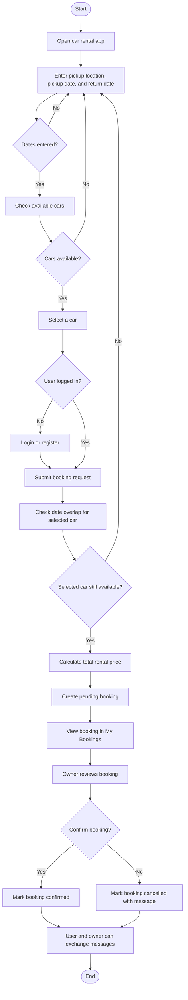

# Activity Diagram

```mermaid
flowchart TD
    Start([Start])
    Browse[Open car rental app]
    Search[Enter pickup location, pickup date, and return date]
    ValidateDates{Dates entered?}
    Availability[Check available cars]
    CarsFound{Cars available?}
    SelectCar[Select a car]
    LoginCheck{User logged in?}
    Login[Login or register]
    SubmitBooking[Submit booking request]
    CheckOverlap[Check date overlap for selected car]
    IsAvailable{Selected car still available?}
    CalculatePrice[Calculate total rental price]
    CreateBooking[Create pending booking]
    ViewBookings[View booking in My Bookings]
    OwnerReview[Owner reviews booking]
    OwnerDecision{Confirm booking?}
    Confirm[Mark booking confirmed]
    Cancel[Mark booking cancelled with message]
    Chat[User and owner can exchange messages]
    End([End])

    Start --> Browse
    Browse --> Search
    Search --> ValidateDates
    ValidateDates -- No --> Search
    ValidateDates -- Yes --> Availability
    Availability --> CarsFound
    CarsFound -- No --> Search
    CarsFound -- Yes --> SelectCar
    SelectCar --> LoginCheck
    LoginCheck -- No --> Login
    Login --> SubmitBooking
    LoginCheck -- Yes --> SubmitBooking
    SubmitBooking --> CheckOverlap
    CheckOverlap --> IsAvailable
    IsAvailable -- No --> Search
    IsAvailable -- Yes --> CalculatePrice
    CalculatePrice --> CreateBooking
    CreateBooking --> ViewBookings
    ViewBookings --> OwnerReview
    OwnerReview --> OwnerDecision
    OwnerDecision -- Yes --> Confirm
    OwnerDecision -- No --> Cancel
    Confirm --> Chat
    Cancel --> Chat
    Chat --> End
```
