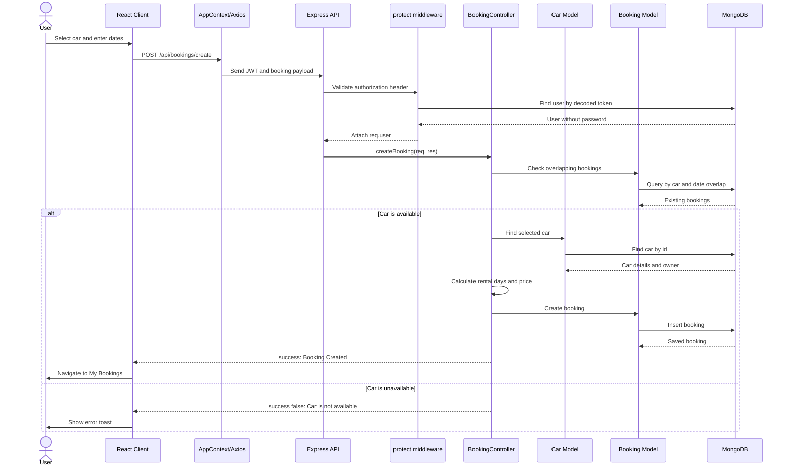

# Booking Sequence Diagram

```mermaid
sequenceDiagram
    actor User
    participant Client as React Client
    participant Context as AppContext/Axios
    participant API as Express API
    participant Auth as protect middleware
    participant BookingController
    participant Car as Car Model
    participant Booking as Booking Model
    participant DB as MongoDB

    User->>Client: Select car and enter dates
    Client->>Context: POST /api/bookings/create
    Context->>API: Send JWT and booking payload
    API->>Auth: Validate authorization header
    Auth->>DB: Find user by decoded token
    DB-->>Auth: User without password
    Auth-->>API: Attach req.user
    API->>BookingController: createBooking(req, res)
    BookingController->>Booking: Check overlapping bookings
    Booking->>DB: Query by car and date overlap
    DB-->>Booking: Existing bookings

    alt Car is available
        BookingController->>Car: Find selected car
        Car->>DB: Find car by id
        DB-->>Car: Car details and owner
        BookingController->>BookingController: Calculate rental days and price
        BookingController->>Booking: Create booking
        Booking->>DB: Insert booking
        DB-->>Booking: Saved booking
        BookingController-->>Client: success: Booking Created
        Client->>User: Navigate to My Bookings
    else Car is unavailable
        BookingController-->>Client: success false: Car is not available
        Client->>User: Show error toast
    end
```
