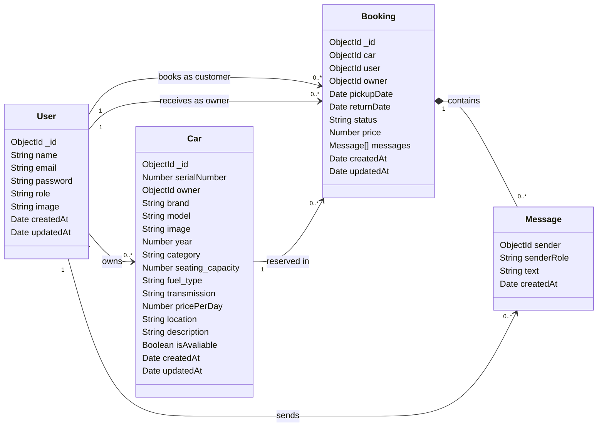

# Class Diagram

```mermaid
classDiagram
    direction LR

    class User {
        ObjectId _id
        String name
        String email
        String password
        String role
        String image
        Date createdAt
        Date updatedAt
    }

    class Car {
        ObjectId _id
        Number serialNumber
        ObjectId owner
        String brand
        String model
        String image
        Number year
        String category
        Number seating_capacity
        String fuel_type
        String transmission
        Number pricePerDay
        String location
        String description
        Boolean isAvaliable
        Date createdAt
        Date updatedAt
    }

    class Booking {
        ObjectId _id
        ObjectId car
        ObjectId user
        ObjectId owner
        Date pickupDate
        Date returnDate
        String status
        Number price
        Message[] messages
        Date createdAt
        Date updatedAt
    }

    class Message {
        ObjectId sender
        String senderRole
        String text
        Date createdAt
    }

    User "1" --> "0..*" Car : owns
    User "1" --> "0..*" Booking : books as customer
    User "1" --> "0..*" Booking : receives as owner
    Car "1" --> "0..*" Booking : reserved in
    Booking "1" *-- "0..*" Message : contains
    User "1" --> "0..*" Message : sends
```
