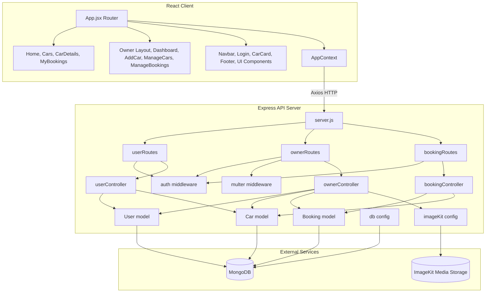

# Component Diagram

```mermaid
flowchart TB
    subgraph Client[React Client]
        App[App.jsx Router]
        Context[AppContext]
        PublicPages[Home, Cars, CarDetails, MyBookings]
        OwnerPages[Owner Layout, Dashboard, AddCar, ManageCars, ManageBookings]
        SharedComponents[Navbar, Login, CarCard, Footer, UI Components]
    end

    subgraph Server[Express API Server]
        Express[server.js]
        UserRoutes[userRoutes]
        OwnerRoutes[ownerRoutes]
        BookingRoutes[bookingRoutes]
        Auth[auth middleware]
        Upload[multer middleware]
        UserController[userController]
        OwnerController[ownerController]
        BookingController[bookingController]
        UserModel[User model]
        CarModel[Car model]
        BookingModel[Booking model]
        DBConfig[db config]
        ImageKitConfig[imageKit config]
    end

    subgraph External[External Services]
        MongoDB[(MongoDB)]
        ImageKit[(ImageKit Media Storage)]
    end

    App --> PublicPages
    App --> OwnerPages
    App --> SharedComponents
    App --> Context
    Context -->|Axios HTTP| Express

    Express --> UserRoutes
    Express --> OwnerRoutes
    Express --> BookingRoutes

    UserRoutes --> Auth
    OwnerRoutes --> Auth
    OwnerRoutes --> Upload
    BookingRoutes --> Auth

    UserRoutes --> UserController
    OwnerRoutes --> OwnerController
    BookingRoutes --> BookingController

    UserController --> UserModel
    UserController --> CarModel
    OwnerController --> UserModel
    OwnerController --> CarModel
    OwnerController --> BookingModel
    OwnerController --> ImageKitConfig
    BookingController --> BookingModel
    BookingController --> CarModel

    DBConfig --> MongoDB
    UserModel --> MongoDB
    CarModel --> MongoDB
    BookingModel --> MongoDB
    ImageKitConfig --> ImageKit
```
