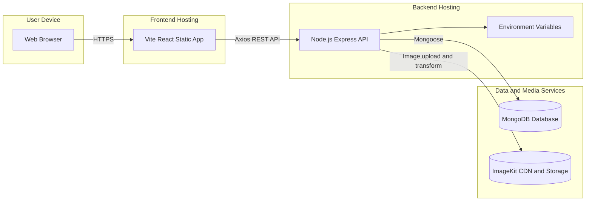

# Deployment Diagram

```mermaid
flowchart LR
    subgraph UserDevice[User Device]
        Browser[Web Browser]
    end

    subgraph FrontendHost[Frontend Hosting]
        ReactApp[Vite React Static App]
    end

    subgraph BackendHost[Backend Hosting]
        ExpressAPI[Node.js Express API]
        Env[Environment Variables]
    end

    subgraph DataServices[Data and Media Services]
        MongoDB[(MongoDB Database)]
        ImageKit[(ImageKit CDN and Storage)]
    end

    Browser -->|HTTPS| ReactApp
    ReactApp -->|Axios REST API| ExpressAPI
    ExpressAPI -->|Mongoose| MongoDB
    ExpressAPI -->|Image upload and transform| ImageKit
    ExpressAPI --> Env
```
