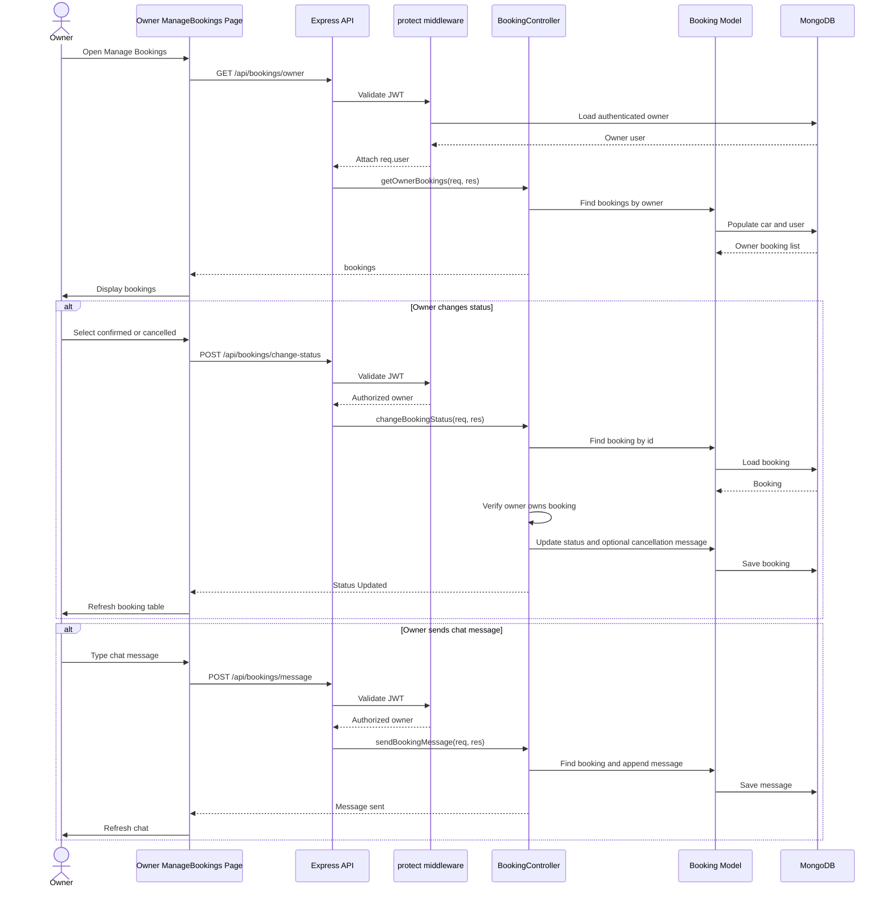

# Owner Booking Management Sequence Diagram

```mermaid
sequenceDiagram
    actor Owner
    participant Client as Owner ManageBookings Page
    participant API as Express API
    participant Auth as protect middleware
    participant BookingController
    participant Booking as Booking Model
    participant DB as MongoDB

    Owner->>Client: Open Manage Bookings
    Client->>API: GET /api/bookings/owner
    API->>Auth: Validate JWT
    Auth->>DB: Load authenticated owner
    DB-->>Auth: Owner user
    Auth-->>API: Attach req.user
    API->>BookingController: getOwnerBookings(req, res)
    BookingController->>Booking: Find bookings by owner
    Booking->>DB: Populate car and user
    DB-->>Booking: Owner booking list
    BookingController-->>Client: bookings
    Client->>Owner: Display bookings

    alt Owner changes status
        Owner->>Client: Select confirmed or cancelled
        Client->>API: POST /api/bookings/change-status
        API->>Auth: Validate JWT
        Auth-->>API: Authorized owner
        API->>BookingController: changeBookingStatus(req, res)
        BookingController->>Booking: Find booking by id
        Booking->>DB: Load booking
        DB-->>Booking: Booking
        BookingController->>BookingController: Verify owner owns booking
        BookingController->>Booking: Update status and optional cancellation message
        Booking->>DB: Save booking
        BookingController-->>Client: Status Updated
        Client->>Owner: Refresh booking table
    end

    alt Owner sends chat message
        Owner->>Client: Type chat message
        Client->>API: POST /api/bookings/message
        API->>Auth: Validate JWT
        Auth-->>API: Authorized owner
        API->>BookingController: sendBookingMessage(req, res)
        BookingController->>Booking: Find booking and append message
        Booking->>DB: Save message
        BookingController-->>Client: Message sent
        Client->>Owner: Refresh chat
    end
```
