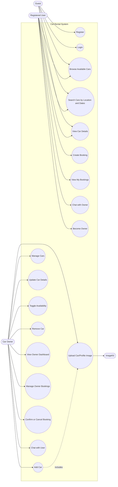

# Use Case Diagram

```mermaid
flowchart LR
    Guest([Guest])
    Customer([Registered User])
    Owner([Car Owner])
    ImageKit([ImageKit])

    subgraph System[Car Rental System]
        Register((Register))
        Login((Login))
        BrowseCars((Browse Available Cars))
        SearchCars((Search Cars by Location and Dates))
        ViewDetails((View Car Details))
        CreateBooking((Create Booking))
        ViewMyBookings((View My Bookings))
        ChatOwner((Chat with Owner))
        BecomeOwner((Become Owner))
        AddCar((Add Car))
        ManageCars((Manage Cars))
        UpdateCar((Update Car Details))
        ToggleAvailability((Toggle Availability))
        RemoveCar((Remove Car))
        Dashboard((View Owner Dashboard))
        ManageBookings((Manage Owner Bookings))
        ChangeStatus((Confirm or Cancel Booking))
        ChatUser((Chat with User))
        UploadImages((Upload Car/Profile Image))
    end

    Guest --> Register
    Guest --> Login
    Guest --> BrowseCars
    Guest --> SearchCars
    Guest --> ViewDetails

    Customer --> BrowseCars
    Customer --> SearchCars
    Customer --> ViewDetails
    Customer --> CreateBooking
    Customer --> ViewMyBookings
    Customer --> ChatOwner
    Customer --> BecomeOwner

    Owner --> AddCar
    Owner --> ManageCars
    Owner --> UpdateCar
    Owner --> ToggleAvailability
    Owner --> RemoveCar
    Owner --> Dashboard
    Owner --> ManageBookings
    Owner --> ChangeStatus
    Owner --> ChatUser
    Owner --> UploadImages

    AddCar -. includes .-> UploadImages
    UploadImages --> ImageKit
```
